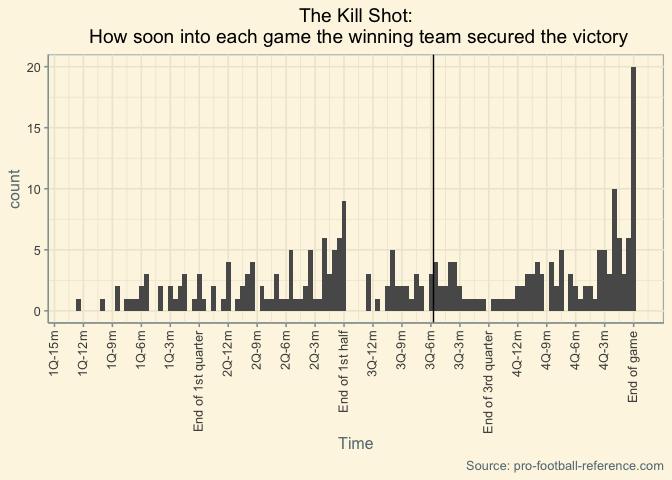

The Killshot: How soon into each game the winning team secured the victory
================
Lewis Pipkin
7/7/2019

A few nights ago, I was a little restless and bored waiting for Kawhi to announce his decision, so I decided to take my mind off of basketball for a while and dig into some football drive summaries (a huge thanks to [pro-football-reference](pro-football-reference.com)!). I had a nice idea: At what point in each game was the game *over?*

What I mean is, at what point could the winning team have just stopped scoring, and they still would have won? The football equivalent of what is called, in baseball, the [game-winning RBI](https://en.wikipedia.org/wiki/Game-winning_RBI). (This was pointed out to me by another Reddit user, I don't know anything about baseball and I certainly wasn't alive in the 80s, when that was a recorded statistic.)

So, let's see how we can figure this out, and then visualize it.

``` r
library(readxl)
library(tidyverse)
```

    ## ── Attaching packages ──────────── tidyverse 1.2.1 ──

    ## ✔ ggplot2 3.2.0     ✔ purrr   0.3.2
    ## ✔ tibble  2.1.3     ✔ dplyr   0.8.3
    ## ✔ tidyr   0.8.3     ✔ stringr 1.4.0
    ## ✔ readr   1.3.1     ✔ forcats 0.4.0

    ## ── Conflicts ─────────────── tidyverse_conflicts() ──
    ## ✖ dplyr::filter() masks stats::filter()
    ## ✖ dplyr::lag()    masks stats::lag()

``` r
library(ggthemes)
```

``` r
nfl <- read_excel("Documents/nfl scoring drives.xlsx")
```

    ## New names:
    ## * Tm -> Tm...1
    ## * Opp -> Opp...4
    ## * Tm -> Tm...9
    ## * Opp -> Opp...10

``` r
head(nfl, 10)
```

    ## # A tibble: 10 x 10
    ##    Tm...1  Year Date                Opp...4 Result   Yds   Qtr
    ##    <chr>  <dbl> <dttm>              <chr>   <chr>  <dbl> <dbl>
    ##  1 SFO     2018 2018-09-23 00:00:00 KAN     L 38-…    58     4
    ##  2 PHI     2018 2018-09-23 00:00:00 IND     W 20-…    75     4
    ##  3 NWE     2018 2018-09-16 00:00:00 JAX     L 31-…    83     2
    ##  4 OAK     2018 2018-09-23 00:00:00 MIA     L 28-…    68     2
    ##  5 GNB     2018 2018-09-23 00:00:00 WAS     L 31-…    75     3
    ##  6 JAX     2018 2018-09-16 00:00:00 NWE     W 31-…    71     3
    ##  7 NOR     2018 2018-09-23 00:00:00 ATL     W 43-…    80     5
    ##  8 JAX     2018 2018-09-09 00:00:00 NYG     W 20-…    54     2
    ##  9 CLE     2018 2018-09-20 00:00:00 NYJ     W 21-…    75     4
    ## 10 OAK     2018 2018-09-23 00:00:00 MIA     L 28-…    67     3
    ## # … with 3 more variables: Time <dttm>, Tm...9 <dbl>, Opp...10 <dbl>

We import the data and check out the first few rows. The first team corresponds with the result, so we're going to want only `Result`s that start with a 'W'. Also, importing from Excel sometimes gives you some weird dates or times, so we'll have to fix the `Time` column as well. So, we'll rename columns and filter down to what we need:

``` r
names(nfl)[1] <- 'winner'
names(nfl)[4] <- 'loser'
names(nfl)[9] <- 'winner score'
names(nfl)[10] <- 'loser score'
nfl <- nfl[which(grepl("W",nfl$Result)),]
nfl$Time <- str_extract(nfl$Time,"[:digit:][:digit:]\\:[:digit:][:digit:](?=\\:)")
```

Then we'll need to convert that time into seconds so we can graph the data clearly.

``` r
nfl$time_remaining <- (4-nfl$Qtr)*15*60 + as.numeric(str_extract(nfl$Time,'[:digit:][:digit:](?=\\:)'))*60+as.numeric(str_extract(nfl$Time,'(?<=\\:)[:digit:][:digit:]'))
```

This is where the interesting stuff starts: we need to pull out the winning score and find only the drive where the winning score was scored.

``` r
nfl$go_ahead_score <- as.numeric(str_extract(nfl$Result,"(?<=\\-)[:digit:]+"))
nfl %>% filter(`winner score` >= go_ahead_score) -> nfl
nfl %>% arrange(Date,winner,`winner score`) -> A
```

All of the scoring drives after the killshot are also included in there, though. So we'll have to remove duplicates based on `winner` and `Date`, because the same team can't win twice on the same date. Since they're arranged by Date, winner, and score, all in ascending order, it's pretty easy:

``` r
A[!duplicated(A[,c('winner','Date')]),] -> B
```

Then we convert how far we are into the game into how far we are to the end, which is just the total number of seconds (60 seconds \* 15 minutes \* 4 quarters = `3600`) in the game minus the time remaining. Then we filter out overtime games (games ending in ties were already filtered out earlier because there was no game-sealing drive).

``` r
B$time_into_game=3600-B$time_remaining
B %>% filter(time_remaining >= 0) -> B
```

So, here's the final result:

``` r
B %>% ggplot(aes(x=time_into_game)) + geom_histogram(binwidth=30) + 
  scale_x_continuous(name="Time",
                     labels = c(paste0("1Q-",rev(seq(3,15,3)),"m"),
                                "End of 1st quarter",
                                paste0("2Q-",rev(seq(3,12,3)),"m"),
                                "End of 1st half",
                                paste0("3Q-",rev(seq(3,12,3)),"m"),
                                "End of 3rd quarter",
                                paste0("4Q-",rev(seq(3,12,3)),"m"),
                                "End of game"),
                     breaks = seq(0, 3600, 180)) +
  theme_solarized() + 
  geom_vline(xintercept=median(B$time_into_game)) +
  theme(axis.text.x = element_text(angle = 90, hjust = 1,vjust=0.4)) +
  ggtitle("The Kill Shot:\n How soon into each game the winning team secured the victory") +
  theme(plot.title = element_text(color = "black",hjust = 0.5)) +
  labs(caption="Source: pro-football-reference.com")
```



So there you have it! A nice, clean-looking graph of every killshot in the NFL in 2018. In the 2018 season, the 3 most common times the killshot is delivered are at the very end of the game (which is what we all expected), at the two-minute warning in the 2nd half, and at the end of the 1st half. The vertical line is the median killshot time, which is midway through the 3rd quarter.

Bonus: here are a couple of frivolities. The 3 fastest killshots are, as follows (with links!):

``` r
B %>% arrange(time_into_game) %>% head(3)
```

    ## # A tibble: 3 x 13
    ##   winner  Year Date                loser Result   Yds   Qtr Time 
    ##   <chr>  <dbl> <dttm>              <chr> <chr>  <dbl> <dbl> <chr>
    ## 1 KAN     2018 2018-12-30 00:00:00 OAK   W 35-3    84     1 12:41
    ## 2 BUF     2018 2018-09-23 00:00:00 MIN   W 27-6    75     1 10:01
    ## 3 BAL     2018 2018-09-09 00:00:00 BUF   W 47-3    80     1 08:42
    ## # … with 5 more variables: `winner score` <dbl>, `loser score` <dbl>,
    ## #   time_remaining <dbl>, go_ahead_score <dbl>, time_into_game <dbl>

[Tyreek Hill's 67-yarder from Pat Mahomes, Kansas City over Oakland, December 30th.](https://www.chiefs.com/video/patrick-mahomes-tyreek-hill-connect-on-67-yard-td) The Raiders went on to score 3 points.

[Josh Allen's 10-yard rush, Buffalo over Minnesota, September 23rd.](https://www.buffalobills.com/video/can-t-miss-play-josh-allen-10-yard-td-run) Minnesota scored 6 points as Buffalo easily covered the +17 spread. (Shit, they could have covered -17.)

[Alex Collins' 8-yard run, Baltimore over Buffalo, September 9th.](https://www.youtube.com/watch?v=L8wc41FM-Rs) Buffalo scored 3 points, Baltimore scored... 47.

Interestingly enough, Buffalo suffered the earliest killshot of the nascent season at the hands (wings?) of the Ravens, then turned around two weeks later to deliver an earlier one to the Vikings. Sick.

Then we have the top 10 teams in terms of earliest average killshot. This is with minutes remaining in the game:

``` r
B %>% group_by(winner) %>% summarize(mean=mean(time_remaining)/60) %>% arrange(desc(mean)) %>% head(10)
```

    ## # A tibble: 10 x 2
    ##    winner  mean
    ##    <chr>  <dbl>
    ##  1 NWE     29.8
    ##  2 DET     29.4
    ##  3 WAS     28.3
    ##  4 IND     28.1
    ##  5 KAN     26.7
    ##  6 BAL     26.4
    ##  7 JAX     26.2
    ##  8 SFO     25.8
    ##  9 GNB     25.5
    ## 10 CHI     25.2
